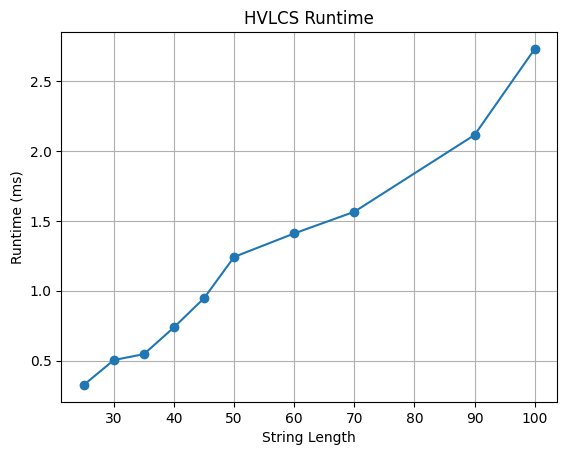

# COP4533 Programming Assignment 3
Thurstan Ngo - 86963382  
Syed Rahman - 95234900

## Running the Program
Type `python3 main.py input_file.txt` into the terminal to run the program (python3 may not be the command setup on your machine in which case you need to use what your computer has it set to)

## Assumptions

## Question 1: Empirical Comparison
| File        | Length of A | Length of B | Runtime(ms)  |
|-------------|-------------|-------------|--------------|
| input1.txt  | 25          | 25          | 0.327        |
| input2.txt  | 30          | 30          | 0.505        |
| input3.txt  | 35          | 35          | 0.547        |
| input4.txt  | 40          | 40          | 0.739        |
| input5.txt  | 45          | 45          | 0.947        |
| input6.txt  | 50          | 50          | 1.242        |
| input7.txt  | 60          | 60          | 1.410        |
| input8.txt  | 70          | 70          | 1.565        |
| input9.txt  | 90          | 90          | 2.114        |
| input10.txt | 100         | 100         | 2.729        |

The runtime increases as the input size increases. This matches the expected results of the DP algorithm which fills an m*n table thus runs in O(mn) time.

## Question 2: Recurrence Equation
Let OPT(i, j) = max value of the longest common subsequence  
Let val($x_i$) = value of character $x_i$  

$$
OPT(i,j) = 
\begin{cases} 
0 & \text{if }i = 0 \text{ or } j = 0 \\
OPT(i-1, j-1) + val(x_i) & \text{if } x_i = y_j \\
\text{max} (OPT(i-1, j) \text{, } OPT(i, j-1)) & \text{otherwise} \\
\end{cases}
$$  

The recurrence is correct. The base cases indicate that if either string has a length of 0, then the value of the HVLCS is 0. If the current characters $x_i$ and $y_j$ match, then take the max value of the longest common subsequence up to the previous indices and add the value of the current character. Otherwise, skip one character from either string and take the max value of the two subsequences.

## Question 3: Big-Oh

### Pseudocode
    Let A and B be the two input strings
    Let m = length of A and n = length of B  
    Create a 2D table dp of size (m+1) x (n+1) initialized to 0  

    For each i from 1 to m:
       For each j from 1 to n:
           If A[i-1] is equal to B[j-1]:
               dp[i][j] = dp[i-1][j-1] + value of A[i-1]
           Else:
               dp[i][j] = max(dp[i-1][j], dp[i][j-1])

    Return dp[m][n]

### Analysis
The algorithm fills a table with m*n entries where m and n are the lengths of the two strings A and B. Every entry is computed in constant time but with nm entries this step takes O(mn) time total. Therefore the overall runtime is O(mn).
